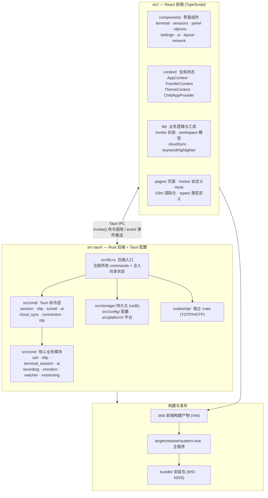

# NyaTerm 架构说明

> 基于 `nyakang/nyaterm` 仓库（v1.2.3）实际代码结构梳理。
> 技术栈：**Tauri 2 + React 19 + TypeScript + Rust**。

## 一、整体架构图



## 二、目录树与各文件夹作用

```text
nyaterm/
├── src/                          # ── React 前端 (TypeScript) ──
│   ├── components/               # 界面组件（按功能域分组）
│   │   ├── terminal/             #   xterm.js 终端核心（XTerminal.tsx）
│   │   ├── sessions/             #   会话列表/新建连接
│   │   ├── panel/                #   左右活动栏面板（文件/网络/监控等）
│   │   ├── rdp/ · vnc/           #   远程桌面协议面板
│   │   ├── settings/             #   设置页
│   │   ├── ui/                   #   共享基础 UI 组件库
│   │   └── layout/ · app/ · network/ · note-editor/ · toast/ · dialog/
│   ├── context/                  # 全局状态容器（React Context）
│   │   ├── AppContext.tsx        #   主窗口核心状态（标签/窗格/连接）
│   │   ├── TransferContext.tsx   #   文件传输队列
│   │   ├── ChildAppProvider.tsx  #   子窗口轻量 Provider
│   │   └── ThemeContext · SettingsDraftContext
│   ├── lib/                      # 业务逻辑与工具函数
│   │   ├── invoke.ts             #   Tauri 命令调用封装（前端↔后端桥）
│   │   ├── workspaceTabs.ts      #   逻辑工作区模型（可持久化）
│   │   ├── tabWindows.ts         #   运行时窗口布局模型
│   │   └── cloudSync.ts · aiEvents.ts · keywordHighlighter.ts ...
│   ├── pages/                    # 页面级组件
│   ├── hooks/                    # 自定义 React Hooks
│   ├── i18n/locales/             # 国际化（en · ko · zh-CN · zh-TW）
│   ├── types/                    # TypeScript 类型定义
│   ├── test/                     # 前端测试
│   ├── main.tsx                  # 入口（区分主窗口/子窗口）
│   └── App.tsx · index.css
│
├── src-tauri/                    # ── Rust 后端 + Tauri 配置 ──
│   ├── src/
│   │   ├── lib.rs                # 后端入口：注册 commands + 注入状态
│   │   ├── main.rs               # 程序入口
│   │   ├── cmd/                  # Tauri 命令层（前端可直接调用的接口）
│   │   │   ├── session.rs        #   会话创建/关闭/写入
│   │   │   ├── sftp.rs · tunnel.rs · proxy.rs  # 文件/隧道/代理
│   │   │   ├── ai.rs · cloud_sync.rs · backup.rs
│   │   │   ├── connection.rs · credential.rs · otp.rs
│   │   │   └── rdp.rs · vnc.rs · docker.rs · gpu.rs ...
│   │   ├── core/                 # 核心业务实现（命令层的底层逻辑）
│   │   │   ├── ssh/              #   SSH 连接、认证、SFTP、隧道
│   │   │   ├── sftp/             #   SFTP 文件操作
│   │   │   ├── terminal_session/ #   终端会话管理
│   │   │   ├── ai/               #   AI 助手（命令生成/Agent）
│   │   │   ├── cloud_sync/       #   加密云同步
│   │   │   ├── recording/        #   会话录制
│   │   │   ├── zmodem/           #   Zmodem 文件传输
│   │   │   ├── watcher/          #   文件监视（本地编辑回传）
│   │   │   ├── monitoring/       #   资源/GPU/NPU 监控
│   │   │   ├── importer/         #   从 Xshell/MobaXterm 等导入
│   │   │   └── history/ · capture/ · translate/ · remote_desktop/ ...
│   │   ├── storage/              # 持久化（redb 嵌入式数据库 + 加密凭据）
│   │   ├── config/               # 配置模型与默认值
│   │   ├── platform/             # 平台相关代码
│   │   ├── utils/                # 工具函数
│   │   └── tray.rs · runtime.rs · window_state.rs ...
│   ├── crates/otp/               # 独立 Rust crate（TOTP/HOTP 一次性密码）
│   ├── capabilities/             # Tauri 权限声明
│   ├── Cargo.toml                # Rust 依赖与 workspace 配置
│   └── tauri.conf.json           # Tauri 应用配置（打包/窗口/更新）
│
├── docs-site/                    # Docusaurus 文档站（中英双语）
├── scripts/                      # 构建/工具脚本（版本同步、补丁、demo）
├── .github/workflows/            # CI（构建快照、发版、AUR/Homebrew/Gitee）
├── package.json                  # 前端依赖与脚本
├── vite.config.ts                # Vite 构建配置
└── biome.json · tsconfig.json    # 代码规范与 TS 配置
```

## 三、分层职责一览

| 层 | 位置 | 职责 |
|---|---|---|
| **界面层** | `src/components/` `src/pages/` | 终端、面板、设置等所有 UI |
| **状态层** | `src/context/` `src/lib/` | 全局状态、工作区模型、业务逻辑 |
| **桥接层** | `src/lib/invoke.ts` | 前端调用后端命令的统一封装 |
| **命令层** | `src-tauri/src/cmd/` | 暴露给前端的 Tauri command |
| **核心层** | `src-tauri/src/core/` | SSH/SFTP/AI/同步等底层实现 |
| **持久层** | `src-tauri/src/storage/` | redb 存储 + 加密凭据 |
| **独立库** | `src-tauri/crates/otp/` | 可复用的 OTP 算法 crate |

## 四、前后端通信机制

- 前端通过 `invoke()` 调用后端 `cmd/` 中注册的 Tauri command。
- 后端通过 **事件** 主动推送数据给前端，例如：
  - `terminal-output-{id}` 终端输出
  - `cwd-changed-{id}` 工作目录变化
  - `transfer-event` 传输队列进度
  - `cloud-sync-status-changed` 同步状态
  - AI 流式事件（响应/推理/命令卡片）
