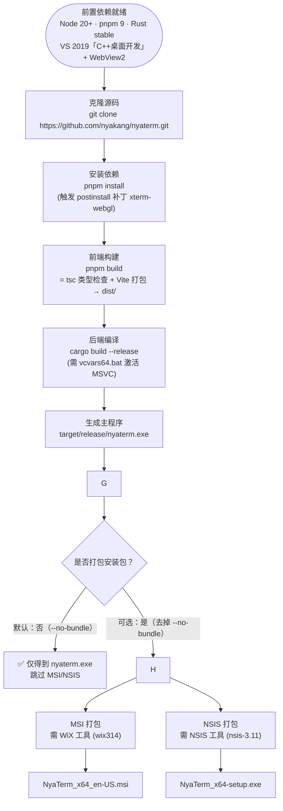

# NyaTerm 编译流程

> 从源码到主程序的构建链路，基于本项目实际构建过程整理。
> 适用环境：**Windows 11（x64）+ MSVC 工具链**。
> 默认模式：**仅编译，不生成 MSI/NSIS 安装包**（`--no-bundle`）。

## 一、编译流程图



## 二、详细步骤（Windows 11）

### 第 1 步：准备前置依赖

| 依赖 | 版本要求 | 说明 |
|---|---|---|
| Node.js | 20 LTS（≥18） | 前端运行时 |
| pnpm | v9 | 包管理器（CI 固定 v9） |
| Rust | stable + `x86_64-pc-windows-msvc` | 后端编译 |
| VS Build Tools | 「使用 C++ 的桌面开发」 | 提供 MSVC 链接器 |
| WebView2 Runtime | 任意 | Win11 一般已预装 |

### 第 2 步：获取源码并安装依赖

```powershell
git clone https://github.com/nyakang/nyaterm.git
cd nyaterm
pnpm install
```

### 第 3 步：编译（默认免打包）

**必须**在 MSVC 环境下执行（否则链接失败）：

```cmd
# 方式一：直接打开「x64 Native Tools Command Prompt for VS 2019」
set NODE_OPTIONS=
cd /d D:\mycode\mycode2026\others\nyaterm
pnpm tauri build --no-bundle

# 方式二：普通 CMD 先激活 MSVC 环境
set NODE_OPTIONS=
call "D:\codetools\VisualStudio\2019\VC\Auxiliary\Build\vcvars64.bat"
cd /d D:\mycode\mycode2026\others\nyaterm
pnpm tauri build --no-bundle

# 方式三：直接跑封装好的 build.cmd（已内置 vcvars64 + 免打包）
cd /d D:\mycode\mycode2026\others\nyaterm
build.cmd
```

`pnpm tauri build --no-bundle` 内部依次执行：
1. `beforeBuildCommand`（`pnpm build`）→ 前端 `tsc` + Vite 打包
2. `cargo build --release` → 编译 Rust 后端
3. **跳过** `bundle` → 不生成 MSI/NSIS 安装包

### 第 4 步：获取产物

```
src-tauri/target/release/nyaterm.exe    # 主程序（免打包模式唯一产物）
```

## 三、如何改为打包安装包（可选）

如果后续需要 MSI/NSIS 安装包，去掉 `--no-bundle` 即可：

```cmd
pnpm tauri build
```

产物：
```
src-tauri/target/release/bundle/msi/*.msi    # MSI 安装包
src-tauri/target/release/bundle/nsis/*.exe   # NSIS 安装包（推荐）
```

## 四、常见坑与解决

| 问题 | 原因 | 解决 |
|---|---|---|
| `linker 'link.exe' not found` | 未用 MSVC 环境 | 用 `vcvars64.bat` 激活，或用 x64 Native Tools 命令行 |
| pnpm/vite 构建被破坏或报错 | WorkBuddy `NODE_OPTIONS` 拦截器污染 pnpm | 每次会话先 `set NODE_OPTIONS=` 清空 |
| `'pnpm' 不是内部或外部命令` | 未装 pnpm | `npm install -g pnpm@9`，重开终端 |

> 以下**仅在打包安装包时才会遇到**（免打包模式不会触发）：

| 问题 | 原因 | 解决 |
|---|---|---|
| 卡在 `Downloading wix314-binaries.zip` | 从 GitHub 下载 WiX，国内网络慢 | 手动下载解压到 `%LOCALAPPDATA%\tauri\WixTools314\` |
| 卡在 `Downloading nsis-3.11.zip` | 同样，NSIS 工具下载慢 | 手动放到 `%LOCALAPPDATA%\tauri\NSIS\`（含 `Plugins\x86-unicode\additional\nsis_tauri_utils.dll`） |
| 尾部报 `TAURI_SIGNING_PRIVATE_KEY` | 配了 updater 公钥但无私钥 | 本地自用可忽略；或把 `createUpdaterArtifacts` 改为 `false` |

## 五、开发模式（可选）

```powershell
pnpm tauri dev    # 完整桌面应用（Vite HMR + Rust 热重编译）
pnpm dev          # 仅前端（Vite，端口 1420）
```

## 六、关键打包缓存路径（仅打包时用）

```
C:\Users\<你>\AppData\Local\tauri\
├── WixTools314\    # WiX 工具（MSI 打包）
└── NSIS\           # NSIS 工具（EXE 打包）
```

> 首次打包会自动下载这两个工具到上述路径；提前手动放好可避免国内网络卡顿。
